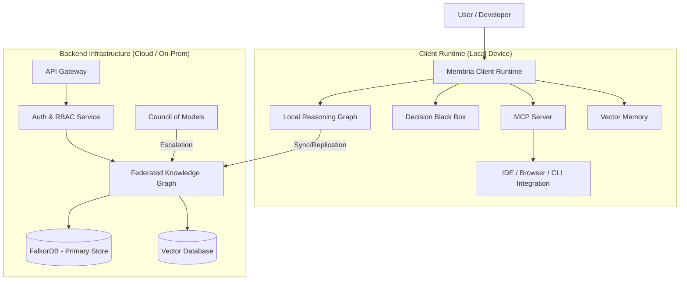

## System Overview

Membria is a distributed, local-first intelligence system designed to persist reasoning and decisions across an organization. It consists of a **Client Runtime** (local memory & reasoning) and a **Backend Layer** (shared knowledge & federation).



---

## Technology Stack

### Core Data Layer
| Component | Technology | Role |
|-----------|------------|------|
| **Graph Database** | **FalkorDB** | Primary storage for decision trees, causality, and temporal relationships. Selected for low-latency Cypher queries and GraphBLAS performance. |
| **Vector Store** | **Qdrant / pgvector** | Semantic search for "similar cases" and evidence retrieval. |
| **Local Storage** | **SQLite** | Local caching of user preferences, session state, and offline graph fragments. |
| **Queues** | **Redis / NATS** | Async event processing for DBB ingestion and outcome tracking. |

### Backend Services
| Component | Technology | Role |
|-----------|------------|------|
| **Core API** | **Julia / Python (FastAPI)** | High-performance reasoning logic and graph traversal. Julia used for complex graph algorithms. |
| **Ingestion** | **Rust / Python** | High-throughput parsing of logs, chat exports, and documents. |
| **Auth** | **OAuth2 / OIDC** | Enterprise SSO integration (Okta, Azure AD, Google). |

### Client Runtime
| Component | Technology | Role |
|-----------|------------|------|
| **Desktop App** | **Tauri / Electron** | Cross-platform UI for Decision Surface and local management. |
| **MCP Server** | **TypeScript / Python** | Model Context Protocol implementation for integrating with Claude, Cursor, and IDEs. |
| **Local Inference** | **Llama.cpp / ONNX** | Running SLMs (Small Language Models) for privacy-preserving local analysis. |

---

## Network Architecture & Data Flow

### 1. Ingestion Pipeline
```
Sources (Slack, GitHub, Docs) 
  → Ingestion Service (Normalization) 
  → ThoughtUnits (Canonical Format) 
  → DBB (Decision Extraction) 
  → Reasoning Graph (Write)
```

### 2. Retrieval Pipeline (GraphRAG)
```
User Query 
  → Retrieval Orchestrator 
  → Permission Check (RBAC) 
  → Hybrid Search (Vector + Graph Traversal) 
  → Context Assembly 
  → LLM Generation
```

### 3. Synchronization (Local-First)
- **Offline Mode:** Client reads/writes to local SQLite/FalkorDB snapshot.
- **Sync:** When online, CRDT-based merging or differential sync pushes changes to the Federated Graph.
- **Conflict Resolution:** "Last write wins" for metadata; manual merge for conflicting reasoning.

---

## Security & Compliance

### Authentication & Authorization
- **RBAC:** Fine-grained role-based access control at the graph node level.
- **Tenancy:** Strict logical isolation between teams/projects in the graph.
- **Audit Logging:** Immutable logs of every decision capture, override, and outcome update.

### Data Protection
- **Encryption at Rest:** AES-256 for all database volumes.
- **Encryption in Transit:** TLS 1.3 for all client-server communication.
- **PII Scrubbing:** Optional redaction pipeline for ingesting sensitive chat logs.

### Cognitive Safety Layer
- **Debiasing:** Automated checks for bias patterns (Anchoring, Confirmation) run *before* commit.
- **Resonance Detection:** Monitoring alignment between user bias and LLM hallucinations.

---

## Infrastructure Requirements (Self-Hosted / Enterprise)

### Minimum Specs
- **CPU:** 4+ cores (8+ recommended for heavy ingestion)
- **RAM:** 16GB+ (32GB+ if running local LLM inference)
- **Storage:** NVMe SSD required for Graph/Vector DB performance.

### Deployment Options
1. **SaaS (Managed):** Fully hosted by Membria. Zero maintenance.
2. **Private Cloud (VPC):** Deployed in customer's AWS/GCP/Azure account via Terraform/Helm.
3. **Air-Gapped:** Fully offline deployment for defense/intel use cases (requires custom enterprise agreement).

---

## Integration Surface

- **IDE:** VS Code Extension (via MCP)
- **CI/CD:** GitHub Actions / GitLab CI runners
- **Chat:** Slack / Teams bots
- **API:** REST & GraphQL endpoints for custom integrations

[View full API Reference →](/api-reference)
