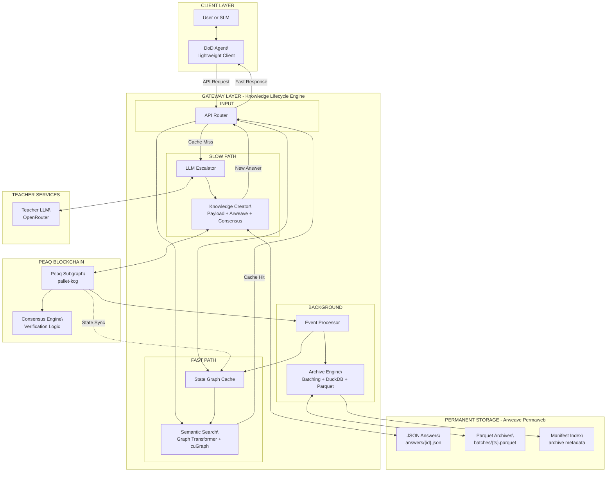
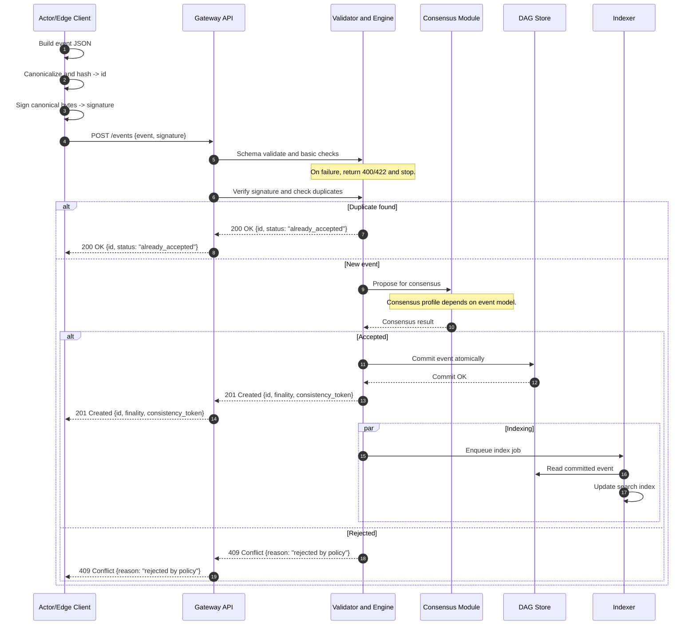
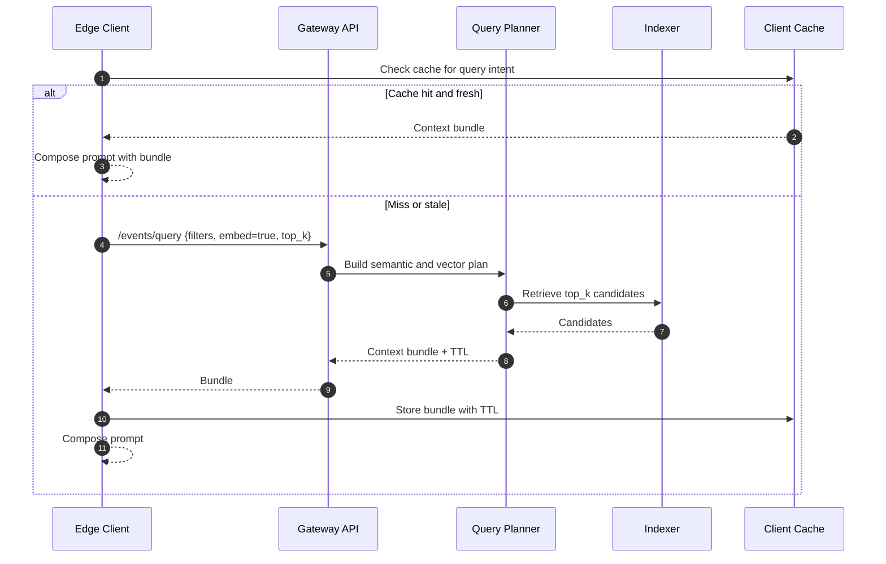
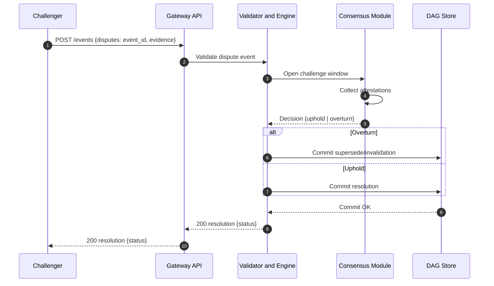
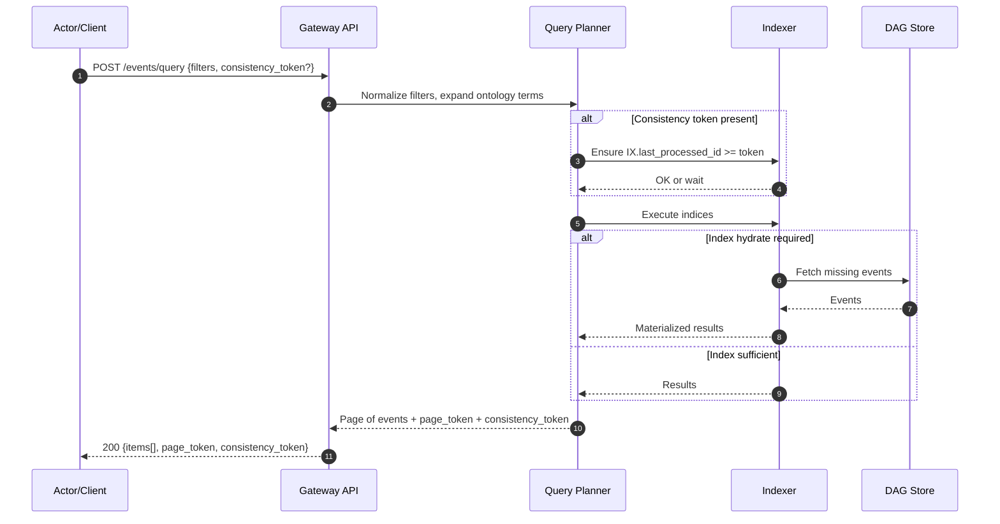
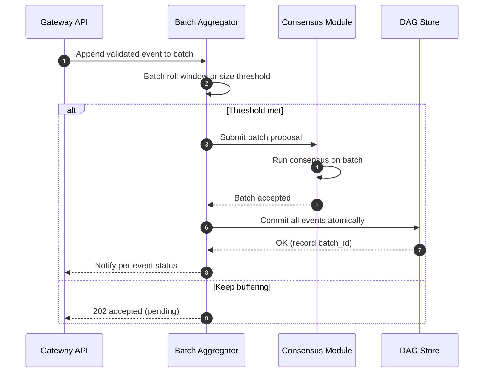
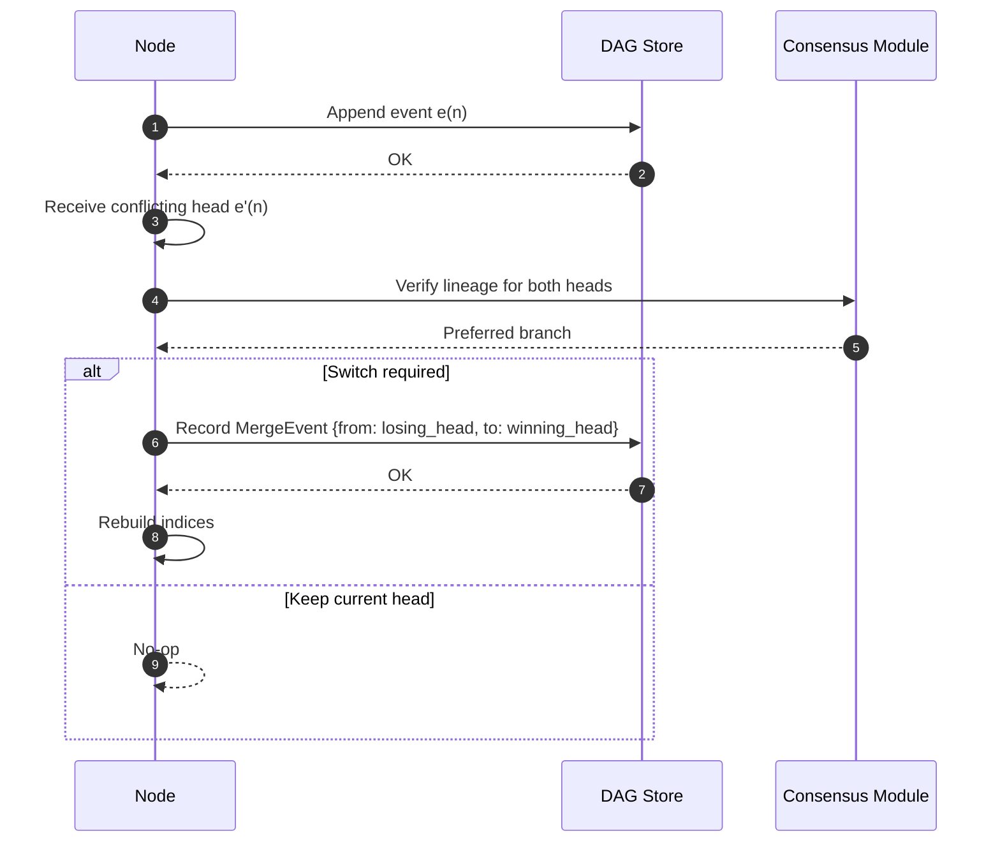
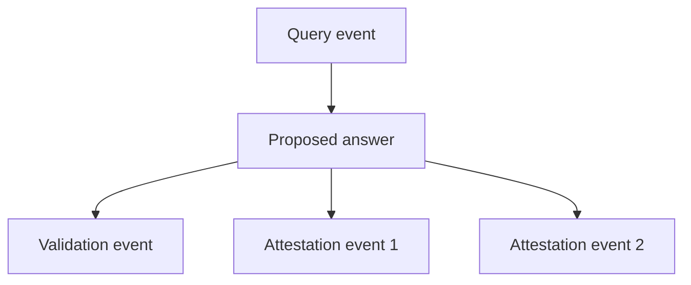

# Decentralized backend architecture

Membria CE uses a decentralized backend to verify, store, and share knowledge artifacts that exceed local confidence. This backend is separate from the client runtime and is invoked only when escalation is required.

## Abstract

Membria uses a hybrid blockchain architecture that separates graph logic from permanent data storage. The Peaq Protocol manages transactional graph logic and consensus, while Arweave stores immutable payloads. The system is designed to support Distillation on Demand (DoD): teacher LLM outputs are verified, recorded as immutable events, and served back to on-device models through cache-augmented generation (CAG).

## 1: Core architecture - a symbiotic hybrid model

Membria leverages two specialized networks:

- Peaq Protocol: logic and graph layer
- Arweave: permanent data storage layer

### Peaq Protocol - logic and graph layer

Peaq handles the Temporal Semantic Graph as a DAG of immutable events. Each event is signed and includes fields such as actor, timestamp, and cause to create an auditable history.

### Arweave - permanent storage layer

Arweave stores the heavy payloads (validated answers, knowledge artifacts). Peaq stores light headers and references to Arweave transactions to keep chain operations fast.

### General scheme



## 2: Decentralized Knowledge Graph (DKG) - layers and components

### Ontology layer - flexible dictionaries

- Dictionaries are reusable collections of concepts and relationships for a domain.
- Public dictionaries (e.g., Schema.org) can be reused; private dictionaries are supported for custom domains.
- Ontology definitions exist as genesis events on Peaq.

### Knowledge layer - validated answers as event chains

- Executable Semantic Models define the schema and validation rules for each knowledge type.
- Verified answers are stored as event chains linked by cause fields, producing a complete audit trail.

## 3: Lifecycle of knowledge - step-by-step protocol

The system treats a query escalation as a Knowledge Distillation Request intent.

### Step 1: Define the knowledge contract on Peaq

Experts deploy an Executable Semantic Model (BSL or equivalent) as a genesis event. This defines the rules for validated knowledge entries.

### Step 2: Propose new knowledge

A DoD agent obtains a teacher LLM response, writes the payload to Arweave, and proposes it on Peaq.

### Step 3: Gateway consensus

Gateways validate the proposal against the contract and vote via Peaq transactions (batched when possible).

### Step 4: Finalize the result

A validation event is recorded on Peaq with final status and confidence score.

## 4: Arweave write protocol

1. Triggered after a teacher LLM response and before Peaq proposal.
2. Payload is assembled as JSON-LD for machine-readable semantics.
3. Arweave transaction is created and tagged.
4. Transaction is signed and broadcast (bundling allowed for cost reduction).
5. Arweave returns the ArTxID.

### Required Arweave tags

| Tag name | Example value | Purpose |
| --- | --- | --- |
| Content-Type | application/ld+json | Data format |
| App-Name | Membria-DKG | Membria ecosystem identifier |
| App-Version | 3.0 | Protocol version |
| Event-Type | ProposedAnswer | Knowledge event type |
| Query-ID | {query_hash_on_peaq} | Link back to Peaq query |

### Payload example (JSON-LD)

```json
{
  "@context": "https://schema.org",
  "@type": "Answer",
  "identifier": "proposed_answer_uuid_xyz123",
  "encodingFormat": "application/ld+json",
  "inResponseTo": {
    "@type": "Question",
    "identifier": "{query_event_hash_on_peaq}"
  },
  "author": {
    "@type": "AIApplication",
    "name": "GPT-4-Turbo",
    "version": "2024-04-09"
  },
  "dateCreated": "2025-08-12T12:50:20Z",
  "text": "The Membria architecture separates logic and data. The Peaq Protocol manages the graph's transactional logic and structure as a Temporal Semantic Graph of events, while Arweave provides permanent, immutable storage for the actual data payloads.",
  "keywords": ["Membria", "Architecture", "Peaq", "Arweave", "Hybrid Blockchain"]
}
```

## 5: Peaq proposal protocol

After the ArTxID is received, the DoD agent creates a lightweight Peaq transaction that logs a domain event (proposed answer) with:

- data pointer: ArTxID
- cause edge: link to the originating query event

### Gateway consensus on Peaq

A quorum of gateways fetches the payload from Arweave, validates it against the knowledge contract, and submits attestation events (batched where possible).

### Finalization

A final validation event records status (e.g., Verified) and confidence. This closes the intent lifecycle.

## 6: Cost optimization - batching on Peaq

Gateways can batch attestation events into a single Peaq transaction:

1. Gateways sign votes and send them to a coordinator.
2. Coordinator aggregates votes.
3. Single batch transaction is submitted.

This reduces base fees and improves throughput.

## 7: Gateway functionality - reading and managing knowledge

### Read protocol

1. Hot cache lookup (fast KV cache).
2. Semantic and vector index lookup.
3. Targeted Arweave fetch by ArTxID if needed.
4. Assemble context using Selective Contextual Reasoning (SCR).
5. Fallback to DoD if confidence remains low.

### Versioning and updates

Arweave payloads are immutable. Updates create new ArTxID payloads and superseding events on Peaq; gateways update indexes to point to the new canonical version while preserving full lineage.

## 8: Trust, validation, and privacy

- Consensus: PoS validator security with BFT finality on Peaq.
- Disputes: stake-weighted challenge process with slashing for invalid approvals.
- Privacy: zero-knowledge proofs (Peaq ZK layer) for confidential validation.

## 9: Advanced on-device agent capabilities

- Segmented KV buffer and persistent memory to reduce context loss.
- Offline QLoRA pipelines to embed frequently used patterns without large model growth.

## 10: Conclusion

Arweave provides permanence while Peaq provides logic and verification. Together they create a decentralized knowledge graph that is auditable, cost-efficient, and reusable across devices and users.

---

# KCG architectural addendum (engineers and integrators)

## Purpose

This addendum provides operational, indexing, and integrity details for the Knowledge Cache Graph (KCG).

## 1: Formal data model

### 1.1 Canonical event structure

All events must conform to a canonical JSON representation and hashing scheme.

```json
{
  "id": "sha256(<canonical_event_json>)",
  "actor": "did:example:123456789abcdefghi",
  "model": "urn:model:approval_v1",
  "cause": ["<event_id_1>", "<event_id_2>"],
  "base": "<parent_event_id_or_null>",
  "type": "Attribute | Relation | Role | Act | Concept | Individual",
  "value": "<string | number | object | array | null>",
  "timestamp": "2025-08-12T21:15:00Z",
  "meta": {
    "version": "1.0.0",
    "tags": ["..."],
    "signature": "<base64_signature>"
  }
}
```

Additional required fields for deterministic processing:

| Field | Type | Description |
| --- | --- | --- |
| event_id | Hash | Unique hash derived from all fields except signatures |
| version | Integer | Event schema version |
| payload_hash | Hash | SHA-256 of immutable payload on Arweave |
| signatures[] | Array | Signatures from originator and validators |
| ontology_ref | String | Ontology dictionary version reference |

Canonicalization:

- JSON-LD 1.1 framing and URDNA2015 for deterministic serialization
- Hash algorithm: SHA-256 over canonical form

### 1.2 Edge types

Edges in the DAG must be typed:

| Edge type | Purpose |
| --- | --- |
| cause | Causal relationship (required) |
| supersedes | Newer version replaces older event |
| disputes | Links an event to a dispute |
| depends_on | Dependency without strict causality |
| references | Soft reference (citation/metadata) |

Rules:

- DAG must remain acyclic for cause and supersedes.
- Cycles allowed only for references.

### 1.3 Versioning and lineage

- Each event may have zero or one supersedes link.
- Canonical version is the last event in the supersedes chain.
- Clients must support lineage retrieval for audit.

### 1.4 Read/Write API specification

Create event:

```
POST /events
Content-Type: application/json
Body: Event JSON without id (computed by server).
Response: { "id": "<event_id>", "status": "accepted" }
```

Get event:

```
GET /events/{id}
```

Query events:

```
POST /events/query
Content-Type: application/json
{
  "filters": [
    { "field": "actor", "op": "eq", "value": "did:example:123" },
    { "field": "type", "op": "in", "value": ["Attribute", "Relation"] }
  ],
  "limit": 50,
  "offset": 0,
  "order_by": "timestamp"
}
```

### 1.5 Indexing and search

- Semantic index by ontology concepts and properties.
- Full-text index for string values.
- Vector index for embeddings (optional).

Index consistency:

- Each index stores last processed event ID.
- Periodic Merkle proofs verify index matches canonical DAG.

### 1.6 SCR (Selective Context Retrieval) for edge clients

SCR pipeline must define:

- Input constraints: max tokens / payload size
- Context policy: recency, relevance score, ontology match
- Caching: TTL, eviction policy, encryption for private data

Cache format:

```
{
  "event_id": "...",
  "embedding": [ ... ],
  "summary": "...",
  "expires_at": "..."
}
```

### 1.7 Tags and metadata

- Required tags: model, actor, version, timestamp, content_hash.
- Tags must be stable across replays; version changes must be explicit.

### 1.8 Privacy pattern

- Encrypt then store: payload encrypted with a content key (CEK).
- CEK encrypted per recipient using public keys.
- Encrypted payload stored in DAG; key grants managed out-of-band or in a KeyGrant event.

### 1.9 Observability

Minimum metrics:

| Metric | Type | Description |
| --- | --- | --- |
| event_ingest_latency_ms | histogram | Time from reception to commit |
| event_validation_failures_total | counter | Failed validation attempts |
| scr_cache_hit_ratio | gauge | Cache effectiveness for SCR |
| graph_fork_count | counter | Number of local fork resolutions |

### 1.10 Consistency and fork resolution

- Nodes must detect divergent DAG branches.
- Merge rule: prefer branch with more total events; tie-break by earliest last event timestamp.
- Fork resolution must be signed and recorded as a MergeEvent.

### 1.11 Protocol versioning

- SemVer: MAJOR.MINOR.PATCH.
- Breaking changes increment MAJOR.
- Clients must refuse higher MAJOR versions unless compatibility mode is enabled.

### 1.12 Sequence diagram - event ingestion



Notes:

- Idempotency: clients should send Idempotency-Key; server dedupes by hash or key.
- Finality field: none | soft | confirmed depending on consensus profile.
- Consistency token: cursor for read-your-writes.

### 1.13 SCR pipeline



Notes:

- Bundle format: event ids, summaries, citations, optional embeddings.
- Limits: max bundle tokens, per-device cache size, LRU eviction.
- Privacy: bundles may be encrypted; cache must respect TTL and key revocation.

## 2: Gateway index architecture

Gateways maintain:

1. Hot cache (RAM) with TTL-based eviction.
2. Semantic index for ontology concepts.
3. Vector index for embeddings.
4. Arweave pointer map (event_id -> ArTxID).

### Dispute flow (condensed)



### Read/query path (read-your-writes)



### Optional batch aggregation



## 3: Fork resolution protocol

1. Detect competing validation events for the same proposal.
2. Prefer branch with higher stake-weighted consensus; tie-break by earliest finalized timestamp.
3. Mark losing branches as orphaned but keep for audit.

### Fork detection and merge



## 4: DAG implementation on Peaq Protocol

- Nodes represent immutable knowledge events.
- Edges are defined via cause field to enforce causal ordering.
- Topological ordering is enforced at insertion.



### Custom pallet: pallet-kcg

Types:

```
pub struct EventHeader {
  pub event_id: H256,
  pub model_urn: BoundedVec<u8, _>,
  pub actor: BoundedVec<u8, _>,
  pub ts: u64,
  pub ar_tx: Option<BoundedVec<u8, _>>,
}

pub struct Adjacency {
  pub event_id: H256,
  pub cause: BoundedVec<H256, _>,
}

pub struct BatchCommit {
  pub batch_id: H256,
  pub merkle_root: H256,
  pub count: u32,
}
```

Extrinsics:

- `propose_event(header: EventHeader, adj: Adjacency, sig: Signature)`
- `finalize_event(event_id: H256) or finalize_batch(commit: BatchCommit)`
- `dispute(event_id: H256, evidence_ref: Vec<u8>)`
- `checkpoint(root: H256, height: u64)`

Runtime events:

- Proposed(event_id)
- Finalized(event_id | batch_id)
- Disputed(event_id)
- Checkpoint(root)

## 5: Write path (two practical modes)

### Mode A - header only on Peaq, payload on Arweave

1. Client canonicalizes and signs payload.
2. Upload payload to Arweave and get ar_tx.
3. Propose event with header and adjacency.
4. Gateways validate signature, availability, parents, and acyclicity.
5. Event is proposed, then finalized via quorum or batch.
6. Indexers fetch payloads and update local indices.

### Mode B - full payload on Peaq (tiny events)

Use only for minimal facts; costs rise quickly.

### Batching on Peaq

- Aggregate event_ids off-chain and compute Merkle root.
- Submit finalize_batch to the pallet.
- Emit Finalized(batch_id).

### Identity and signatures

- Bind DID to Peaq account or use DID-Key for signing.
- Signatures are over the same canonical bytes used to derive event_id.

### Reading

- Light clients query Peaq headers and fetch payloads from Arweave if ar_tx is present.
- Heavy clients subscribe to runtime events and maintain local indices.

### Consistency and finality

- Treat events as final only after Peaq block finalization.
- On reorgs, reprocess affected headers and record MergeEvent.

### Disputes

- dispute(event_id, evidence_ref) opens a challenge window.
- Resolution emits Finalized(superseding_event_id) or Resolution(event_id, status=upheld).
- Indexers link supersedes on resolution.

### Cost control

- Keep headers compact and move bulk to Arweave.
- Prefer batch finalization.
- Compress adjacency and include parent set hash when needed.

### Minimal guarantees

- Integrity: event_id is sha256(canonical(payload)) and signatures match.
- Acyclicity: enforced before accept; rejected events are never posted.
- Replay safety: duplicate event_id is idempotent.
- Discoverability: stable tag schema and runtime keys.

## 6: DAG implementation on Arweave (alternative)

### What lives on Arweave

- Full event payloads (JSON-LD, optionally encrypted)
- Adjacency (cause event IDs)
- Detached signatures (or embedded)
- Minimal headers duplicated in tags

Example payload:

```
{
  "id": "ev_<sha256(canonical_bytes)>",
  "actor": "did:example:abc",
  "model": "urn:model:approval_v1",
  "type": "Attribute|Relation|Act|Concept|Individual|Role",
  "value": { "...": "..." },
  "cause": ["ev_...","ev_..."],
  "timestamp": "2025-08-12T21:15:00Z",
  "signature": "base64(ed25519(sig over canonical_bytes))",
  "meta": { "version": "1.0.0", "content_hash": "sha256(...)" }
}
```

### Arweave transaction layout

- Data: canonical event JSON (optionally encrypted).
- Tags:
  - App: KCG
  - App-Version: 1.0.0
  - Event-Id: ev_...
  - Event-Type: Attribute|Relation|...
  - Actor-DID: did:...
  - Model-URN: urn:model:...
  - Cause-Id: repeated per parent
  - Timestamp: ISO8601
  - Content-Hash: sha256(...)
  - Sig-Alg: ed25519
  - Sig-Base64: detached signature (if not embedded)

### Acyclicity and validation

Gateways validate before upload:

- cause exists
- id matches canonical hash
- signatures verify
- no path back from any cause to this id

### Batching

- Use Bundlr (or Arweave bundles).
- Create a batch manifest with batch_id, list of event ids, and Merkle root.
- Store manifest as its own Arweave tx with tags.

### Read path

- Query Arweave GraphQL by tags and hydrate events.
- Verify id, signatures, and cause references.
- Maintain local adjacency index and topo order.

### Consistency and finality

- Use signed checkpoints (KCG-Checkpoint tag) with a Merkle root and high-water mark.
- Clients can trust up to the last checkpoint without replaying all events.

### Disputes

- Dispute is another event with type Act and a disputes tag.
- Gateways emit supersedes events to overturn.

## 7: API contracts

### Event ingestion API

- POST /events
- Payload:

```json
{
  "event_id": "...",
  "version": 1,
  "payload_hash": "...",
  "ontology_ref": "schema.org/v1",
  "signatures": ["sig1", "sig2"],
  "cause": "event_hash",
  "data_pointer": "ArTxID"
}
```

### Event query API

- GET /events/{event_id}
- Supports query by event_id, ontology_concept, vector_embedding

## 8: Privacy enhancements

- Gateways can issue ZK proofs of validation without exposing raw data.
- Example: prove a fact was checked against a private dataset without revealing it.

## 9: Metrics and observability

Operational metrics for gateways:

- avg_query_latency_ms
- cache_hit_ratio
- consensus_vote_time
- fork_resolution_count
- arweave_retrieval_time

Expose metrics via /metrics in Prometheus format.

## 10: Security considerations

- Replay protection: event includes nonce and timestamp.
- Sybil resistance: gateway participation requires staking on Peaq.
- Data immutability enforced by Arweave permanence.

## 11: Conclusion

This backend architecture provides verified, auditable knowledge flow while preserving a lightweight client. It maintains performance and integrity without abandoning the hybrid Peaq (logic) + Arweave (storage) model.
