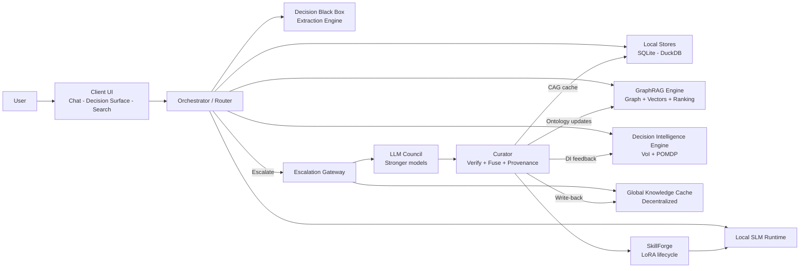
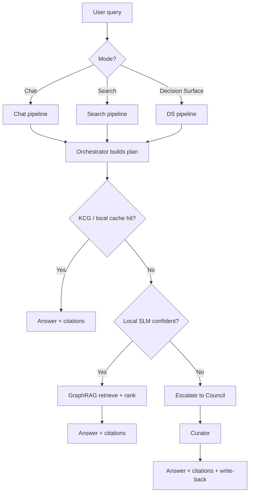
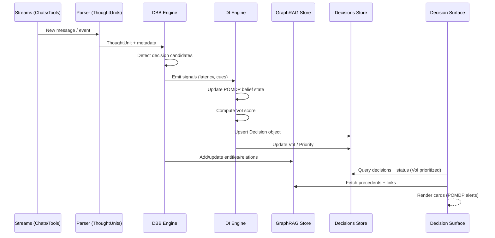
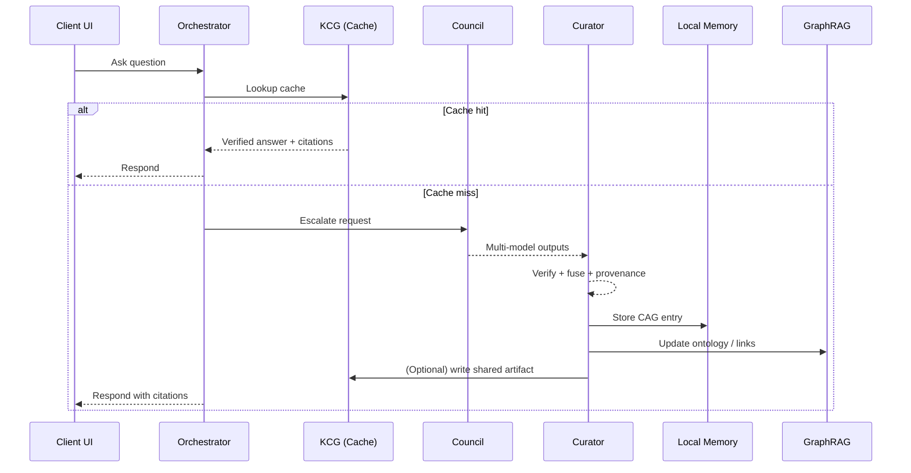
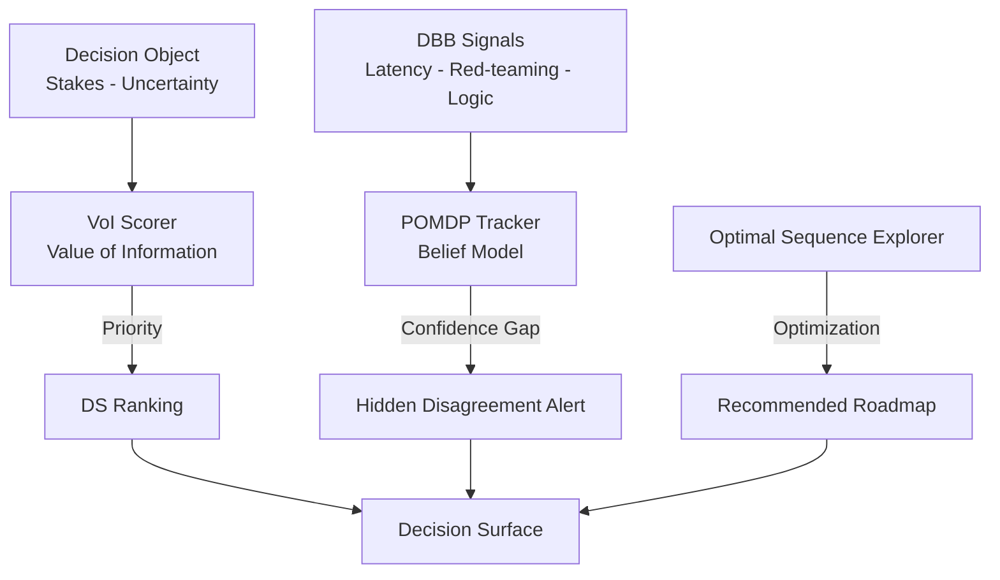

> This file contains reference diagrams for the Membria CE runtime.
> All diagrams use Mermaid so they can render in GitHub/GitLab/docs pipelines.

---

## 1) System overview

---

## 2) Query routing decision tree

---

## 3) Ingestion pipeline (cold start)

```mermaid
flowchart LR
  A["Connected sources (Drive - Email - Slack - Chat logs)"] --> B["Structural parsing (no heavy reasoning)"]
  B --> C["ThoughtUnits (ts, author, thread, uri, type)"]
  C --> D[Cheap embeddings]
  D --> E[Semantic clustering]
  E --> F["Reasoning skeleton (form only)"]
  F --> G["Conservative heuristics (stability/drift flags)"]
  G --> H[DBB candidates + Graph updates]
  H --> I[Decision Surface can render]
```

---

## 4) Decision Black Box lifecycle

---

## 5) Council escalation + caching loop

---

## 6) Decision Intelligence Loop

