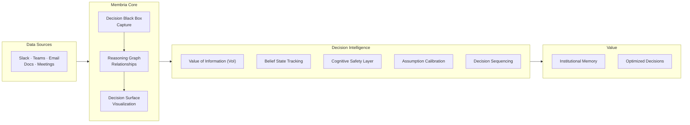

# Membria Technology Overview

> AI-Powered Institutional Memory for Better Decision Making.

## What is Membria

Membria is the **Smart Persistence Layer** for enterprise AI. It connects people, teams, and AI models so that knowledge, reasoning, and decisions do not reset after a conversation ends.

Most AI systems are **stateless**. The AI answers, forgets, and starts over.

Membria is the missing layer: **persistent decision intelligence**.

---

## The Core Problem

### The Decision Black Hole

Teams make hundreds of decisions daily in Slack, email, meetings, and documents. Within weeks:

-   **Nobody remembers** exactly what was decided.
-   **Context is lost** — why did we choose this?
-   **Outcomes are detached from reality** — did it work?
-   **The same discussions repeat**, wasting time and energy.

Traditional Knowledge Management captures documents, not decisions. Search tools find information, not reasoning logic. AI assistants answer questions but instantly forget them.

### The Cost of the Problem

| Problem | Business Impact |
| :--- | :--- |
| **Re-litigating decisions** | 15-20% of meeting time wasted |
| **Lost commitments** | Missed deadlines, eroded trust |
| **No outcome tracking** | Repeating mistakes, zero learning |
| **Context loss (turnover)** | 3-6 months to restore knowledge |

---

## The Membria Solution

### Smart Persistence Layer

Membria sits between your communication tools and your team's collective intelligence:



### Three Core Components

#### 1. Decision Black Box (DBB)

An automatic capture engine that monitors team communications and extracts:

-   **Decisions** — explicit choices made.
-   **Commitments** — promises with owners and deadlines.
-   **Assumptions** — core beliefs behind decisions.
-   **Alternatives** — options considered but rejected.

DBB creates **immutable records**: original reasoning logic is preserved before outcomes can distort memory (preventing "Hindsight Bias").

#### 2. Reasoning Graph (GraphRAG)

Connects decisions into a persistent reasoning network:

-   **Temporal Links** — how decisions evolved over time.
-   **Causal Chains** — which decisions led to what outcomes.
-   **Dependencies** — what blocks what.
-   **Patterns** — recurring decision types and their results.

Unlike document-centric knowledge bases, Membria's graph is structured around **Decisions** as first-class objects.

#### 3. Decision Surface (DS)

A live dashboard of team decisions, displaying:

-   **Open Loops** — discussions without closure.
-   **Commitments** — promises nearing deadlines.
-   **Decisions Pending** — awaiting approval.
-   **Assumption Drift** — context changed, decision may be stale.
-   **Outcome Tracking** — what worked, what didn't.

---

## Deep Dive: Decision Surface

### What the Dashboard Shows

Decision Surface turns raw data into actionable signals:

| Signal | Description | Example |
| :--- | :--- | :--- |
| **Open Loops** | Discussions without explicit closure | "Pricing strategy discussed 3x, no decision recorded" |
| **Commitments** | Promises with owners and dates | "@sarah: provide proposal by Friday" |
| **Pending Decisions** | Made but awaiting sign-off | "New vendor selected, awaiting CFO signature" |
| **Assumption Drift** | Topic same, vocabulary changed | "Jan: 'growth', Mar: 'cost cutting' — no pivot decision" |
| **Blocking** | Decisions waiting on dependencies | "Launch blocked by Legal Review (12 days)" |
| **Hidden Disagreement** | Surface agreement masks doubt | "Decision marked 'Consensus', but belief confidence only 40%" |

### How It Works

Decision Surface does not read chats directly. It visualizes only structured signals from the Decision Black Box:

1.  **Capture** — DBB extracts decision signals from dialogue.
2.  **Structure** — Signals become immutable decision records.
3.  **Connect** — Reasoning Graph links related decisions.
4.  **Surface** — DS shows what needs attention right now.

### User Interaction

Decision Surface is a review and orientation layer, not a task manager:

-   **Click** any decision for full context.
-   **Add** outcomes when results become known.
-   **Mark** decisions as superseded or resolved.
-   **Link** decisions to new tasks or follow-up work.

No maintenance required. The system updates automatically.

---

## Decision Intelligence Layer

Beyond reactive monitoring, Membria adds predictive and optimizing intelligence based on decision theory algorithms.

### 1. Value of Information (VoI)

**Function:** Scores "Open Loops" and "Pending Decisions" by their impact if resolved.

```math
VoI(D) = E[Utility | Info] - E[Utility | No Info] - Cost(Info)
```

**Example:**
```
Open Loop "Pricing Strategy": VoI = $180k
  → Pricing error: $180k/year revenue loss
  → Gathering market data: costs $5k, takes 3 days
  → Recommendation: PRIORITIZE (High impact, clear ROI)

Open Loop "Meeting Format": VoI = $2k
  → Format error: $2k productivity hit
  → Recommendation: DEFER (Low impact, solve later)
```

**Benefit:** Prioritizes decisions by **impact**, not urgency or job title. Tells leaders: "Resolve Loop #7 first — it's worth $180k".

---

### 2. Belief State Tracking (POMDP)

**Function:** Detects "Hidden Disagreement" — when the team seems agreed, but system confidence is low.

**How it works:**
-   Extracts signals (explicit agreement, silence, skeptical questions, contradictory actions).
-   Maintains belief distribution: `P(True Consensus | Observed Signals)`.
-   Updates probabilities as new evidence arrives.

**Example:**
```
Decision: "Hire 5 engineers in Q2"
Observed Data:
  - 3 explicit "Agreed"
  - 1 person silent
  - 2 skeptical questions
  - 0 hiring tickets created

Belief Distribution:
  - True Consensus: 40%
  - Surface Agreement Only: 35%
  - Misunderstanding: 25%

⚠️ Alert: Low consensus confidence (40%).
    Recommendation: Re-open for explicit discussion.
```

**Benefit:** Prevents decisions that *look* made but will fail in execution. Catches misalignment before it costs time.

---

### 3. Assumption Calibration

**Function:** Tracks confidence in assumptions and updates beliefs based on real outcomes.

**How it works:**
-   Every decision records confidence: "We are 75% sure of this vendor".
-   Later, outcome is recorded: "Vendor delivered" or "Vendor failed".
-   Bayesian Update: Confidence is adjusted to reality.
-   Pattern Detection: "You overestimate vendor reliability by 15%".

**Benefit:** Reveals systematic **biases**. Enables fine-tuning (LoRA) of decision models based on real calibration data.

---

### [NEW] 4. Cognitive Safety Layer

**Function:** Protects against cognitive biases and hallucinations via "System 2 Thinking".

**Components:**
1.  **Bias Firewall:** Checks incoming decisions for known biases (Confirmation Bias, Sunk Cost).
2.  **Resonance Detection:** If AI agrees too quickly and confidently (Resonance Score > 0.6) — it's suspicious. The system forces a "friction" check.
3.  **Debiasing Interventions:** Active intervention. E.g., if "Anchoring" is detected, the system prompts: "Consider 3 alternatives before approving."

**Benefit:** AI acts as a "Devil's Advocate", not a yes-man, improving thought quality.

---

### 5. Decision Sequence Optimizer (Priority Queue)

**Function:** Recommends optimal order of dependent decisions to minimize blocking, based on priority and uncertainty.

**How it works:**
-   Analyzes decision dependency graph.
-   Uses a **Priority Queue** instead of complex simulations (MCTS).
-   Scores decisions: `Score = (VoI * Urgency) / Duration * UncertaintyMultiplier`.
-   Recommends order maximizing value (VoI) per unit time.

**Example:**
```
Decisions & Dependencies:
  D1: Tech Stack → blocks D2, D3, D4 (Score: 88)
  D5: Budget → blocks D1, D6 (Score: 95 - Critical Path)
  D7: Vendor Selection → blocks D8 (Score: 45)

Current Approach (FIFO):
  D1 → blocked waiting for D5 → Total time: 6 weeks

Optimized Sequence (Priority Queue):
  D5 (95) → D1 (88) → [D2, D3, D4, D6, D7 parallel] → Total time: 3 weeks

Recommendation: Resolve Budget (D5) immediately — critical blocker.
```

**Benefit:** Fast, transparent removal of bottlenecks. Algorithm is human-understandable and runs instantly.

---

### 6. Outcome Tracking & Real-Time Learning

**Function:** Links outcomes back to original decisions to improve future predictions.

**How it works:**
-   When outcome is known, system records: Prediction vs Reality.
-   Aggregates calibration data by decision type.
-   Identifies patterns: which teams are well-calibrated vs overconfident.
-   Adjusts confidence scoring based on empirical data.

**Benefit:** Teams learn from evidence. Decision intelligence improves over time via data-driven feedback loops.

---

## AI Principles

### Evidence-Based Intelligence

Membria AI follows strict epistemic rules. All claims are backed by traceable evidence:

**Format:**
```
[Insight] → [Evidence: sources, dates, counts]
```

**Correct Example:**
> "Project X shows a risk pattern: 3 missed commitments, 2 assumption changes, no updated decisions for 30 days."

**Incorrect Example:**
> "The team doesn't believe in Project X."

### What AI Never Does
-   Psychological guessing ("feels frustrated", "shows detachment").
-   Personal judgment ("is a blocker", "toxic employee").
-   Unfounded prediction ("project will fail").

### What AI Always Does
-   Cites specific evidence.
-   Uses cautious language ("pattern suggests", "based on last 14 days data").
-   Separates observation from interpretation.

---

## Enterprise Capabilities

### Role-Based Visibility

Different roles see different scopes on the Decision Surface:

| Role | Sees | Does Not See |
| :--- | :--- | :--- |
| **Individual Contributor** | Own decisions, full context, related decisions | Private reasoning of others |
| **Manager / Director** | Aggregated team data, patterns, alerts | Individual reasoning details |
| **C-Level** | Company metrics, cross-team dependencies | Details (unless triggers activate) |

### Privacy Principles

1.  **Reasoning is Private** — Only the decision owner sees their thinking process.
2.  **Outcomes are Shared** — Results are visible to the team.
3.  **Signals are Visible** — Everyone knows a decision exists.
4.  **Aggregation > Exposure** — Leaders see patterns, not surveillance.
5.  **Access on Trigger** — Detailed view require justification.

### Tensions Detection

Automatic detection of hidden team misalignment:

-   **Bimodal Analysis** — Same topic, two opposing approaches.
-   **Assumption Drift** — Vocabulary shift without explicit decision.
-   **Conflicting Commitments** — Working in different directions on same goal.

**Example Alert:**
```
⚠️ Tension Detected: "Q2 Hiring Plan"
Team is split on implementation approach.
No explicit decision resolves the gap.
Recommendation: Surface for open discussion.
```

### Audit & Compliance
-   Immutable decision records with timestamps.
-   Full data provenance (Source → Capture → Decision).
-   Reproducible analysis (fixed-seed algorithms).
-   Data export for regulatory requirements.

---

## Use Cases

### Case 1: Scaling Startup (5 → 50 people)

**Problem:** Early decisions lived in founders' heads. As team grew, context was lost. New hires made decisions contradicting old ones unknowingly.

**Solution:** Membria captured decisions from Day 1. When employee #30 arrived, they could see:
-   Why this tech stack was chosen.
-   Which monetization models were rejected and why.
-   Which partnerships were already explored.

**Result:**
-   Onboarding time cut by 40%.
-   Zero "we tried that already" moments.
-   Alignment across all teams.

### Case 2: Remote Team Synchronization

**Problem:** Distributed team across 4 time zones. Decisions made in various Slack channels, never consolidated. Weekly syncs wasted on context restoration.

**Solution:** Decision Surface provided a unified view. Open loops visible to all. Commitments tracked automatically.

**Result:**
-   Meetings shortened from 60 to 25 mins.
-   Commitment completion rate up 35%.
-   "Where did we land on X?" questions vanished.

### Case 3: Product Team Velocity

**Problem:** Product decisions scattered across Jira, Slack, Notion, Email. PMs spent hours reconstructing history for stakeholders.

**Solution:** Membria unified sources. Every feature decision linked to original debate, alternatives considered, and post-release outcome.

**Result:**
-   "Decision Archaeology" time: 2 hours → 5 mins.
-   Stakeholder trust increased (transparent audit).
-   Post-mortems accelerated by full context.

### Case 4: Investment Committee

**Problem:** Investment decisions made in meetings. Months later, unclear why a deal was approved/rejected. "Hindsight bias" prevented learning.

**Solution:** DBB captured logic *before* decision, with confidence levels. Outcomes linked later without altering original thesis.

**Result:**
-   Visibility into true "hit rate" (not reconstructed memory).
-   Pattern detection: "We overvalue founder pedigree".
-   Prediction accuracy (calibration) up 20% in 18 months.

### Case 5: Compliance & Audit

**Problem:** Documentation of decisions was required in a regulated industry. Manual process was inconsistent, incomplete, and loathed by the team.

**Solution:** Membria automatically captured decisions with all supporting evidence. Immutable records satisfied audit requirements.

**Result:**
-   Audit preparation time cut by 80%.
-   Zero gaps in documentation.
-   Actual system usage (since it required no extra work).

### Case 6: M&A Integration

**Problem:** Acquiring company needed to understand how the target company made decisions. Cultural and process differences were opaque.

**Solution:** Membria's Reasoning Graph revealed:
-   How decisions actually flowed (vs. the org chart).
-   Where the real centers of influence resided.
-   Recurring tensions and patterns.

**Result:**
-   Integration plan based on reality, not assumptions.
-   Key decision-makers identified and retained.
-   Cultural gaps bridged proactively.

---

### Technical Architecture

Membria's architecture is designed for high-performance reasoning using a hybrid storage approach.

#### Graph Memory: FalkorDB
The core Reasoning Graph is powered by **FalkorDB**, which provides:
- **Low-Latency Traversals:** Utilizing GraphBLAS for high-speed relationship analysis.
- **Cypher Query Language:** Standardized, high-performance access to decision chains.
- **Redis-Based Persistence:** Combining memory speed with durable storage.

#### Deployment Options

| Option | Description | Best For |
| :--- | :--- | :--- |
| **SaaS** | Managed cloud, multi-tenant | SMBs, Startups, Remote Teams |
| **Enterprise Cloud** | Dedicated instance | Mid-market, Data Locality needs |
| **On-Premise** | Self-hosted, full control | Banks, Gov, Regulated Industries |

### Integrations

**Communications:**
-   Slack
-   Microsoft Teams
-   Email (Gmail, Outlook)
-   Zoom (meeting transcripts)

**Documentation:**
-   Notion
-   Confluence
-   Google Docs
-   SharePoint

**Task Management:**
-   Jira
-   Linear
-   Asana
-   Monday

**Custom:**
-   REST API
-   Webhooks
-   SSO (SAML, OIDC)

### Data Processing

```mermaid
flowchart LR
    input["Raw Data<br/>Chat, Docs, Meetings"] --> extract["DBB Extraction<br/>Decision Signals"]
    extract --> structure["Structure<br/>Immutable Records"]
    structure --> graph["GraphRAG<br/>Links & Indexing"]
    graph --> surface["Decision Surface<br/>Visualization"]

    outcome["Outcomes<br/>(added later)"] --> link["Link to Record<br/>(append only)"]
    link --> graph

    graph --> voi["VoI<br/>Impact Weight"]
    graph --> belief["Belief State<br/>Consensus Confidence"]
    graph --> safe["Bias Firewall<br/>Safety Checks"]
    graph --> calib["Calibration<br/>Belief Update"]
    graph --> seq["Sequencing<br/>Priority Queue"]

    voi --> surface
    belief --> surface
    safe --> surface
    seq --> surface

    outcome --> calib
    calib --> learn["Learning Model<br/>Calibration Patterns"]
```

### Privacy & Security

-   **Encryption:** AES-256 at rest, TLS 1.3 in transit.
-   **Access Control:** RBAC, Audit Logging.
-   **Data Locality:** EU, US, or Custom Regions.
-   **Compliance:** SOC 2 Type II, GDPR, HIPAA ready.
-   **Retention:** Configurable retention policies with secure deletion.

---

## Comparison

### Membria vs. Traditional Knowledge Management (KM)

| Aspect | Traditional KM | Membria |
| :--- | :--- | :--- |
| **Unit of Storage** | Document | Decision |
| **Capture Method** | Manual | Automatic |
| **Structure** | Folders/Tags | Reasoning Graph |
| **Outcome Tracking** | No | Yes |
| **Hindsight Defense** | No | Yes |
| **Show Unresolved** | No | Yes |

### Membria vs. AI Assistants

| Aspect | ChatGPT / Copilot | Membria |
| :--- | :--- | :--- |
| **Memory** | Ephemeral (Session) | Persistent |
| **Knows Decisions** | No | Yes |
| **Team Aware** | No | Yes |
| **Evidence Based** | Sometimes | Always |
| **Impact Priority** | No | Yes (VoI) |
| **Disagreement Detection** | No | Yes (POMDP) |
| **Cognitive Safety** | No | Yes (Bias Firewall) |
| **Calibration Learning** | No | Yes |
| **Sequence Optimization** | No | Yes (Priority Queue) |

### Membria vs. Task Managers

| Aspect | Jira / Asana | Membria |
| :--- | :--- | :--- |
| **Tracking Object** | Task | Decision |
| **Capture Reasoning** | No | Yes |
| **Auto-Detect from Chat** | No | Yes |
| **Assumption Drift** | No | Yes |
| **Measure Quality** | No | Yes |
| **VoI Priority** | No | Yes |
| **Hidden Disagreement** | No | Yes (POMDP) |
| **Cognitive Safety** | No | Yes (Bias Firewall) |
| **Calibration Learning** | No | Yes |
| **Sequence Optimization** | No | Yes (Priority Queue) |
| **Learning from Data** | No | Yes |

---

## Getting Started

### SaaS (Teams)

1.  Sign up at membria.ai
2.  Connect Slack or Teams
3.  Invite team members
4.  Decision Surface populates automatically

Time to value: **< 1 hour**

### Enterprise

1.  Contact Sales for deployment options.
2.  Security & Compliance review.
3.  Integrate Membria with existing tools.
4.  Configure roles and training.
5.  Pilot with one team, then scale.

Implementation time: **2–4 weeks**

---

## Summary

**Membria is AI-powered Institutional Memory fused with Decision Intelligence for better choices.**

**Core Capabilities:**
-   **Captures** decisions automatically from team dialogue.
-   **Preserves** reasoning before outcomes distort memory.
-   **Connects** decisions into a searchable Knowledge Graph.
-   **Surfaces** what needs attention: loops, drift, blockers.
-   **Tracks** outcomes for real team learning.

**Intelligence Layer Adds:**
-   **Value of Information (VoI):** Prioritize by impact, not urgency.
-   **Belief Tracking:** Detect hidden disagreement before execution.
-   **Cognitive Safety:** Protect against confirmation bias and groupthink.
-   **Assumption Calibration:** Identify most accurate teams and decision types.
-   **Decision Sequencing:** Recommend optimal order to unblock work.
-   **Outcome Learning:** Improve decision quality via data-driven feedback.

**Result:** Teams remember what they decided, learn from results, make smarter choices faster, and improve continuously through data-calibrated feedback.

---

## Learn More

-   **Documentation:** docs.membria.ai
-   **API Reference:** api.membria.ai
-   **Sales:** sales@membria.ai
-   **Community:** community.membria.ai

---

*Membria by Actiquest Labs — Persistent Decision Intelligence*
