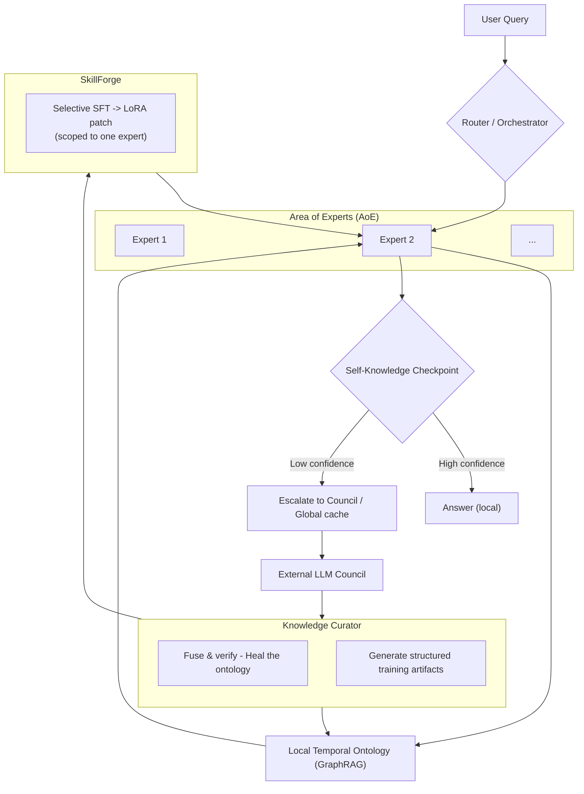

# Membria CE Client

Membria CE Client is the user-facing application that turns "having a model" into "having a persistent intelligence system".
It can run as **Membria Cloud (managed)** today and later as **Membria Self-Hosted (local/on-device)**, while using the same core principles:
**local-first reasoning where possible, explicit memory, explainable retrieval, and selective escalation**.

This document describes the client architecture and how it connects to Membria's decentralized knowledge backend.

---

## 1) What the client is responsible for

The client is not just a chat UI. It is a full runtime that:

- **Runs a local Small Language Model (SLM)** when available.
- Maintains **long-term memory** (structured + searchable).
- Builds and queries **GraphRAG** (knowledge graph + vectors) for grounded answers.
- Detects **decisions and turning points** (Decision Black Box -> feeds Decision Surface).
- Performs **escalations** to a Council of stronger models when local reasoning is insufficient.
- **Caches** verified answers and structured reasoning artifacts so intelligence compounds over time.
- Enforces **privacy, permissions, and transparency** around data sources and tool use.

---

## 2) Mental model (what "compounds")

Most AI tools reset: every new chat starts from scratch or with shallow "memory".

Membria compounds through three assets:

1. **Working context** (continuous, session-level)  
2. **Personal knowledge layer** (GraphRAG + structured memory)  
3. **Skill layer** (LoRA patches + domain adapters)  

When local AI is not enough, Membria escalates, then **brings back** what it learned as cache + graph updates + optional training artifacts.

---

## 3) High-level architecture

```mermaid
flowchart LR
  U[User] --> UI[Membria Client UI
(Chat - Decision Surface - Search)]
  UI --> ORCH[Router / Orchestrator]

  ORCH --> SLM[Local SLM Runtime
(optional now, default later)]
  ORCH --> MEM[Local Memory Layer
(SQLite + DuckDB)]
  ORCH --> GR[Local GraphRAG
(Temporal Ontology + Vectors)]
  ORCH --> DBB[Decision Black Box
(decision extraction agent)]

  ORCH -->|Escalate only if needed| COUNCIL[LLM Council
(10 models)]
  COUNCIL --> KCG[Global Knowledge Cache / KCG
(decentralized)]
  COUNCIL --> CUR[Knowledge Curator
(verification + fusion)]
  CUR -->|Updates| GR
  CUR -->|CAG / cache entries| MEM
  CUR -->|Optional training artifacts| SF[SkillForge
(LoRA generation)]
  SF --> SLM
```

---

## 4) Interfaces (Chat, Decision Surface, Search)

### 4.1 Chat (normal, expected)
- Full "ChatGPT-like" flow.
- Multi-thread support across tools and models.
- Chat is **input**, not the final product: Membria extracts durable artifacts (decisions, assumptions, references, outcomes).

### 4.2 Decision Surface (DS)
A daily "home screen" that summarizes what matters across many chats and tools:

- **Open loops** (unresolved threads, missing confirmation, pending sign-off)
- **Assumption drift** (beliefs that changed across time/sources)
- **Precedents** (similar past decisions and their outcomes)
- **Risks** (uncertainty flags, missing evidence, low confidence areas)

DS reads from the **Decision Black Box + memory graph**, not from raw chat scrollback.

### 4.3 Search (rare, powerful)
Search is not a "summarize my docs" feature. It is **explainable retrieval**:

- Citations to sources
- Link chains ("why this follows from that")
- Graph-aware context (entities, relations, timestamps, threads)

---

## 5) Decision Black Box (DBB)

DBB is an agent/process that continuously logs and extracts "turning points" from the user's information streams.
Think of it as a **flight recorder for reasoning**: it captures *what changed*, *what got decided*, and *why*, without interrupting normal work.

### What DBB stores (structured, not raw dumps)
- Decision candidates (proposal -> commit -> closure)
- Assumptions and confidence
- Evidence links (messages, docs, code diffs)
- Outcome hooks (what to check later and when)

### Where DBB shows up in UI
DBB is primarily backend for DS, but it can optionally expose:
- a lightweight "activity strip" (non-blocking),
- and a "capture prompt" only when confidence is high that a real decision occurred.

DBB should not be a modal "blue screen". It must behave like instrumentation, not a forced ritual.

---

## 6) Orchestrator: the runtime brain

The `Router / Orchestrator` decides:

- Which model runs (local SLM vs escalation)
- Which memory layers are queried
- Whether citations are mandatory (by context)
- How to cache and structure the output

### 6.1 Reliability: Idem-Prompts (tool-safe calls)
When calling tools that require strict formats (JSON, schemas), the orchestrator wraps requests in constraining prompts so the system remains deterministic and safe.

### 6.2 The "Context Explosion" problem
Membria does not keep "everything in the prompt".
Instead it uses **dynamic working memory** plus persistent stores.

---

## 7) Local Memory Layer (Hybrid + Hierarchical)

Membria uses a hybrid approach that is both **embedded** and **fast**:

### 7.1 Hot memory (in-memory, per task)
- session scratchpad
- active reasoning state
- fastest possible access

### 7.2 Warm memory (SQLite persistence)
**SQLite (Transactional Core)**
- chat metadata (not necessarily full raw logs)
- event logs (`event_log`)
- user settings, source scopes, permissions
- Cache-Augmented Generation (CAG) entries pulled from the global cache

Recommended performance mode:
- `PRAGMA journal_mode=WAL;`
- JSON storage via JSON1 for flexible reasoning artifacts

### 7.3 Cold memory (DuckDB analytics + vectors)
**DuckDB (Analytical Engine)**
- embeddings index for large document sets
- semantic search over fragments ("ThoughtUnits")
- analytics over personal knowledge and decisions

This split keeps the client lightweight while enabling fast local search and analysis.

---

## 8) Local GraphRAG and "ThoughtUnits"

The client normalizes imported sources into **ThoughtUnits** (lightweight parsing, not expensive reasoning):

- question
- decision
- comment
- discussion
- timestamp, author, thread id
- source link

GraphRAG uses:
- a temporal ontology (entities + relations over time)
- vectors for similarity search
- graph queries for explainable link chains

---

## 9) When local AI is not enough: Council + Global Cache

Membria is designed to run cheaply most of the time.
When a knowledge gap is detected, it escalates.

### 9.1 Self-knowledge checkpoint
Local expert answers, then runs a confidence check:
- "Do I have enough grounded evidence?"
- "Is the graph context sufficient?"
- "Is uncertainty too high for this domain?"

If confidence is low, the orchestrator escalates.

### 9.2 Council + caching loop
- Query the **LLM Council** (stronger models)
- Prefer answers already present in the **Global Knowledge Cache**
- Verify and fuse via the **Knowledge Curator**
- Write back:
  - cached answer + citations (CAG)
  - ontology updates for GraphRAG
  - optional training artifacts for SkillForge (see next section)

---

## 10) SkillForge and LoRA patches (Selective, domain-shaped)

**LoRA patches** are small expert adapters that increase capability in specific domains.
They do not make a model "generally smarter", but they can close *repeatable, domain-specific* gaps.

### Important critique (and the right framing)
It's tempting to say: "LoRAs accumulate automatically from system outputs."
That can be true **only** if you enforce strict quality gates, because:
- Council outputs can be wrong or non-transferable.
- Training on noisy, situational answers can bake in errors.
- Overfitting to a narrow style can reduce robustness.

So LoRA generation must be:
- selective (only for recurring gaps),
- curated (training data comes from verified, fused artifacts),
- scoped (per-expert or per-domain, not global).

### Area-of-Experts (AoE) + Selective SFT (kept from the previous doc)


---

## 11) Latency and "magic" speed

RAG can be slow by design. Membria mitigates this with:

- **Two-stage retrieval:** fast candidate retrieval -> graph-aware ranking
- **Aggressive caching:** the best retrieval is "no retrieval"
- **Adaptive depth:** not all questions need deep graph expansion
- **Optimistic UI:** show an early grounded response with "verifying" state

---

## 12) Security, privacy, and permissions

Security is not optional because the client touches your full work life.

- **Explicit Access & Scope** (sources + time ranges)
- **Local-by-default** when self-hosted is enabled
- **End-to-end encrypted transport** to gateways
- **Tool permission model** (like mobile apps)
- **Sandboxing** for skills/agents
- **Signature + reputation** for marketplace components (future)

---

## 13) Positioning (updated)

Membria CE is not "another chatbot UI".
It is a system that lets power users run **a persistent, explainable, self-improving intelligence layer** across tools and models.

- For cloud users today: you get compounding intelligence without running infrastructure.
- For self-hosted users later: you get the same system locally, with optional offline operation.
- For both: the **decentralized knowledge backend** remains the shared layer that prevents reinvention and enables verified caching.

---

## Appendix: key terms

- **SLM-first:** default to a smaller, cheaper model + strong memory.
- **Council:** escalation ensemble of stronger models.
- **Global Knowledge Cache / KCG:** shared, verified knowledge artifacts and citations.
- **CAG:** cache-augmented generation (reusing verified answers).
- **GraphRAG:** retrieval that uses a knowledge graph + vectors + explainable link chains.
- **DBB:** Decision Black Box, the "flight recorder" for decisions and turning points.
- **DS:** Decision Surface, the daily view built on DBB + memory graph.
- **LoRA:** scoped adapters to improve domain expertise.
